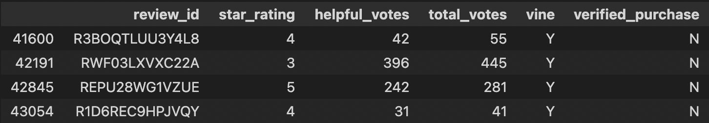
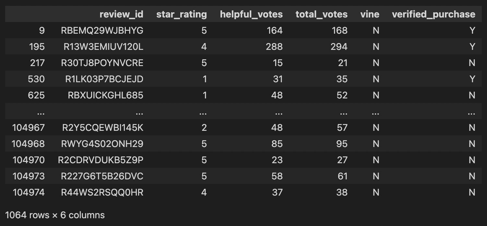
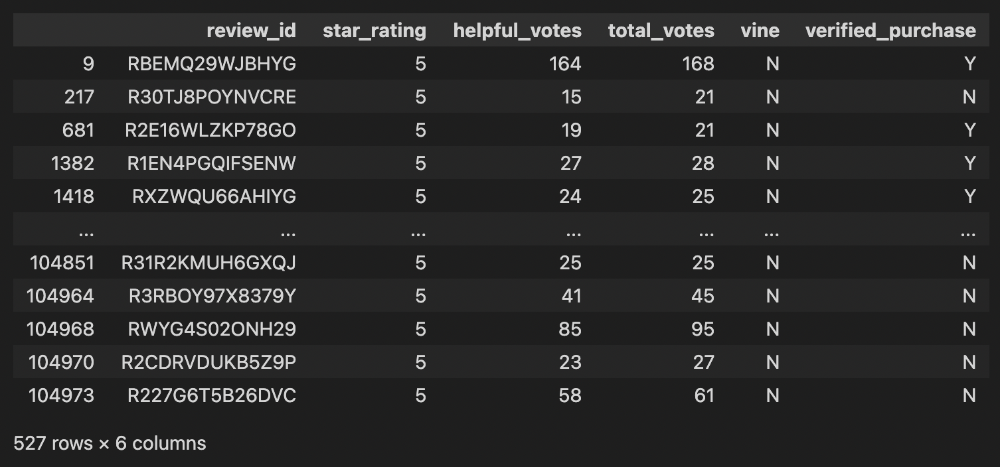

# Amazon_Vine_Analysis

## Overview
The purpose of this analysis is to determine if there is any **bias** toward favorable reviews on mobile electronics from **Amazon Vine** program members. 
Working towards this goal we start by filtering  our initial dataframe to focus on helpful reviews. We determine helpful reviews by dividing helpful votes to total votes. If the resulting value is greater than 0.50 the review is included to our new Dataframe.  
## Results
In this new **DataFrame :**  
  
There are only **4** Vine reviews and **1064** non Vine Reviews  
  
**One** Vine review is a five star rating compared to **527** non Vine five star rating reviews.  
  
**25%** of Vine reviews were 5 stars compared to **49.5%** of non Vine Reviews.  

# Summary
The results indicate there is no positivity bias for reviews in the Vine Program. A greater percentage of 

Looking again at our initial dataset we observe a total of 104975 reviews.Breaking this number down we only have 18 Vine reviews in total while there are 104957 non Vine reviews. A very small sample of Vine reviews compared to a huge sample of non Vine Reviews. 22% of all Vine reviews were declared helpful compared to  only 1% of non Vine. Vine Program does boost the usefulness of reviews without adding positivity bias. 
